# Final Project for Neoversity (SQL)

## Фінальний проект з модуля SQL

## Опис фінального проекту:

Під час виконання проєкту ви закріпите навички створення баз даних, нормалізації таблиць, використання SQL-команд для створення таблиць і маніпулювання даними, отримання даних з РБД: агрегування, сортування, обмеження кількості запитів. Вам також знадобиться вміння пошуку необхідних вбудованих функцій, створення та використання SQL-функцій для обробки даних у реляційних базах даних.

### Завдання 1

 Завантажте дані:

- Створіть схему pandemic у базі даних за допомогою SQL-команди.
- Оберіть її як схему за замовчуванням за допомогою SQL-команди.
- Імпортуйте дані за допомогою Import wizard так, як ви вже робили це у темі 3.
- Продивіться дані, щоб бути у контексті.

```
drop schema if exists pandemic;
create schema pandemic;
use pandemic;

SELECT * FROM infectious_cases;
```

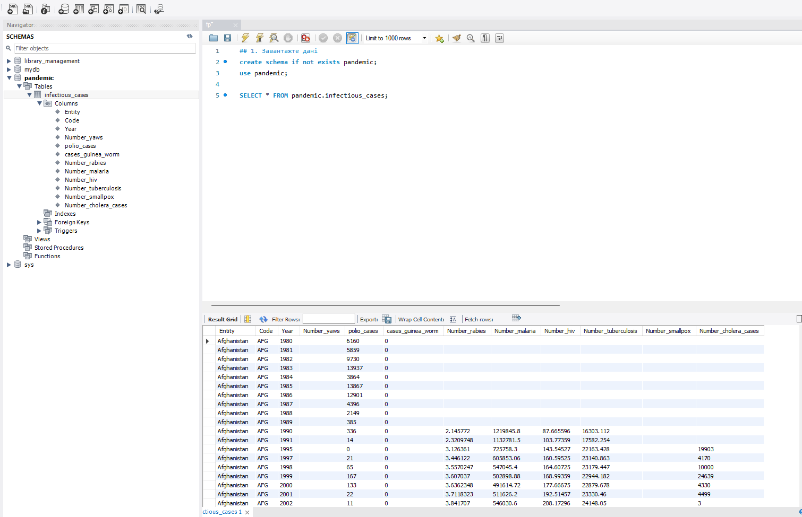

### Завдання 2

Нормалізуйте таблицю infectious_cases до 3ї нормальної форми. Збережіть у цій же схемі дві таблиці з нормалізованими даними.

*Виконайте запит SELECT COUNT(***) FROM infectious_cases , щоб ментор міг зрозуміти, скільки записів ви завантажили у базу даних із файла.*

```
drop table if exists countries;
CREATE TABLE  countries (
    id INT AUTO_INCREMENT UNIQUE PRIMARY KEY,
    entity VARCHAR(125) NOT NULL,
    code VARCHAR(10) NOT NULL
);

insert into countries (entity, code)
select distinct Entity, Code
from infectious_cases;

drop table if exists infectious_cases_normalized;
create table infectious_cases_normalized(
    id INT AUTO_INCREMENT PRIMARY KEY,
    country_id INT NOT NULL,
    year INT NOT NULL,
    polio_cases INT DEFAULT NULL,
    cases_guinea_worm INT DEFAULT NULL,
    Number_yaws FLOAT DEFAULT NULL,
    Number_rabies FLOAT DEFAULT NULL,
    Number_malaria FLOAT DEFAULT NULL,
    Number_hiv FLOAT DEFAULT NULL,
    Number_tuberculosis FLOAT DEFAULT NULL,
    Number_smallpox FLOAT DEFAULT NULL,
    Number_cholera_cases FLOAT DEFAULT NULL,
    CONSTRAINT fk_country
        FOREIGN KEY (country_id)
        REFERENCES countries(id)
);

INSERT INTO infectious_cases_normalized (
    country_id,
    year,
    polio_cases,
    cases_guinea_worm,
    Number_yaws,
    Number_rabies,
    Number_malaria,
    Number_hiv,
    Number_tuberculosis,
    Number_smallpox,
    Number_cholera_cases
)
SELECT
    c.id,
    ic.year,
    NULLIF(ic.polio_cases, ''),
    NULLIF(ic.cases_guinea_worm, ''),
    NULLIF(ic.Number_yaws, ''),
    NULLIF(ic.Number_rabies, ''),
    NULLIF(ic.Number_malaria, ''),
    NULLIF(ic.Number_hiv, ''),
    NULLIF(ic.Number_tuberculosis, ''),
    NULLIF(ic.Number_smallpox, ''),
    NULLIF(ic.Number_cholera_cases, '')
FROM infectious_cases ic
JOIN countries c
    ON ic.Entity = c.entity
    AND ic.Code = c.code;
    
select count(*) as ic_raw from infectious_cases;
select count(*) as c_norm from countries;
select count(*)  as ic_norm from infectious_cases_normalized;
```

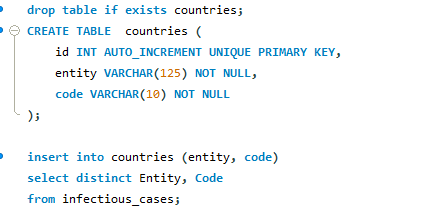
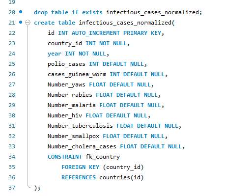
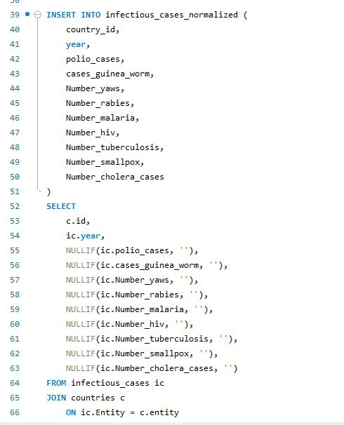

*Результати*

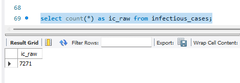
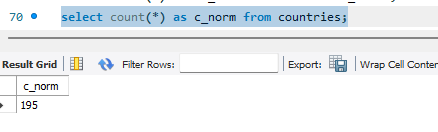
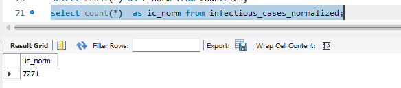


### Завдання 3

Проаналізуйте дані:

- Для кожної унікальної комбінації Entity та Code або їх id порахуйте середнє, мінімальне, максимальне значення та суму для атрибута Number_rabies.
*💡 Врахуйте, що атрибут Number_rabies може містити порожні значення ‘’ — вам попередньо необхідно їх відфільтрувати.*
- Результат відсортуйте за порахованим середнім значенням у порядку спадання.
- Оберіть тільки 10 рядків для виведення на екран.

```
SELECT 
    c.entity,
    c.code,
    c.id,
    ROUND(AVG(ic_norm.Number_rabies), 2) AS avg_rabies,
    ROUND(MIN(ic_norm.Number_rabies), 2) AS min_rabies,
    ROUND(MAX(ic_norm.Number_rabies), 2) AS max_rabies,
    ROUND(SUM(ic_norm.Number_rabies), 2) AS sum_rabies
FROM
    infectious_cases_normalized AS ic_norm
        JOIN
    countries AS c ON ic_norm.id = c.id
WHERE
    ic_norm.Number_rabies IS NOT NULL
GROUP BY c.entity , c.code , c.id
ORDER BY avg_rabies DESC
LIMIT 10;
```

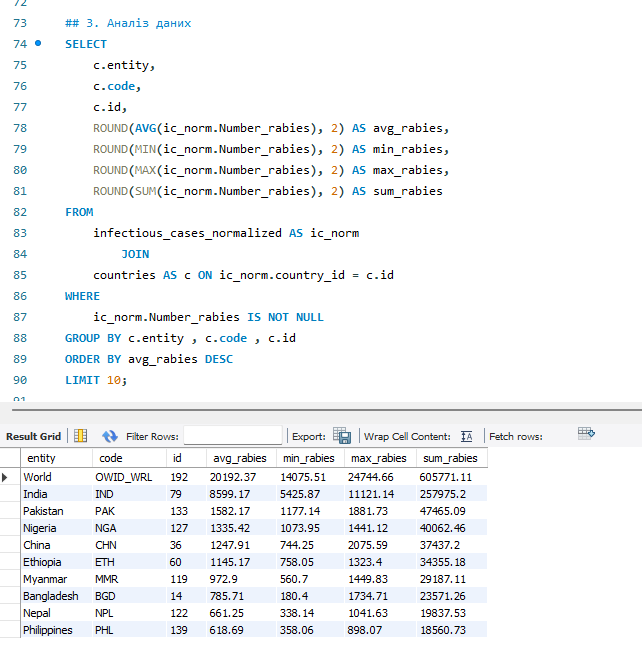

### Завдання 4

Побудуйте колонку різниці в роках.

Для оригінальної або нормованої таблиці для колонки Year побудуйте з використанням вбудованих SQL-функцій:
- атрибут, що створює дату першого січня відповідного року,
*💡 Наприклад, якщо атрибут містить значення ’1996’, то значення нового атрибута має бути ‘1996-01-01’.*
- атрибут, що дорівнює поточній даті,
- атрибут, що дорівнює різниці в роках двох вищезгаданих колонок.
*💡 Перераховувати всі інші атрибути, такі як Number_malaria, не потрібно.*

```
SELECT 
    id,
    year,
    MAKEDATE(year, 1) AS first_day_year,
    CURRENT_DATE() AS cur_date,
    TIMESTAMPDIFF(YEAR,
        MAKEDATE(year, 1),
        CURRENT_DATE()) AS year_diff
FROM
    infectious_cases_normalized
ORDER BY year DESC;
```

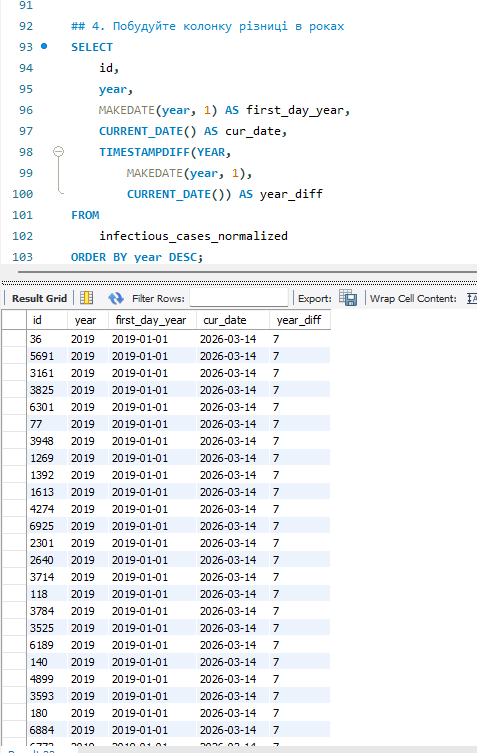

### Завдання 5

Побудуйте власну функцію.

- Створіть і використайте функцію, що будує такий же атрибут, як і в попередньому завданні: функція має приймати на вхід значення року, а повертати різницю в роках між поточною датою та датою, створеною з атрибута року (1996 рік → ‘1996-01-01’).

```
drop function if exists year_diff_func;
delimiter //
create function year_diff_func(input_year int)
RETURNS INT
DETERMINISTIC
BEGIN
    RETURN TIMESTAMPDIFF(
        year,
        MAKEDATE(input_year, 1),
        CURRENT_DATE()
    );
END //

DELIMITER ;

SELECT id,
year,
    makedate(year,1) as first_day_year,
    curdate() as cur_date,
    year_diff_func(year) AS year_diff
FROM infectious_cases_normalized
ORDER BY year desc;
```

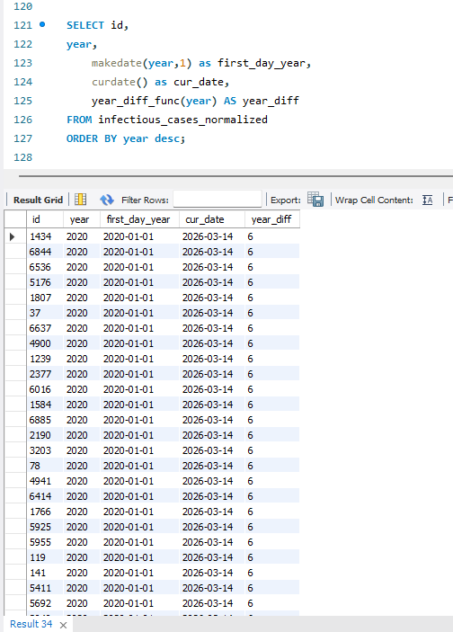

### Завдання 5(Альтернативне)

Побудуйте власну функцію.

Якщо ви не виконали попереднє завдання, то можете побудувати іншу функцію — функцію, що рахує кількість захворювань за певний період. Для цього треба поділити кількість захворювань на рік на певне число: 12 — для отримання середньої кількості захворювань на місяць, 4 — на квартал або 2 — на півріччя. Таким чином, функція буде приймати два параметри: кількість захворювань на рік та довільний дільник. Ви також маєте використати її — запустити на даних. Оскільки не всі рядки містять число захворювань, вам необхідно буде відсіяти ті, що не мають чисельного значення (≠ ‘’).

```
drop function if exists cases_per_period;
delimiter //
create function cases_per_period(cases_per_year float, divisor int)
returns float
deterministic
begin
return cases_per_year / nullif(divisor,0);
end
//

delimiter ;

SELECT 
    c.entity,
    ic_norm.year,
    ic_norm.Number_tuberculosis AS n_tuberculosis,
    ROUND(CASES_PER_PERIOD(ic_norm.Number_tuberculosis, 12),
            0) AS avg_per_month,
    ROUND(CASES_PER_PERIOD(ic_norm.Number_tuberculosis, 4),
            0) AS avg_per_quater,
    ROUND(CASES_PER_PERIOD(ic_norm.Number_tuberculosis, 2),
            0) AS avg_per_half_year
FROM
    infectious_cases_normalized AS ic_norm
        JOIN
    countries AS c ON ic_norm.id = c.id
WHERE
    Number_tuberculosis IS NOT NULL
ORDER BY ic_norm.year DESC , ROUND(CASES_PER_PERIOD(ic_norm.Number_tuberculosis, 12),
        0) DESC;
```

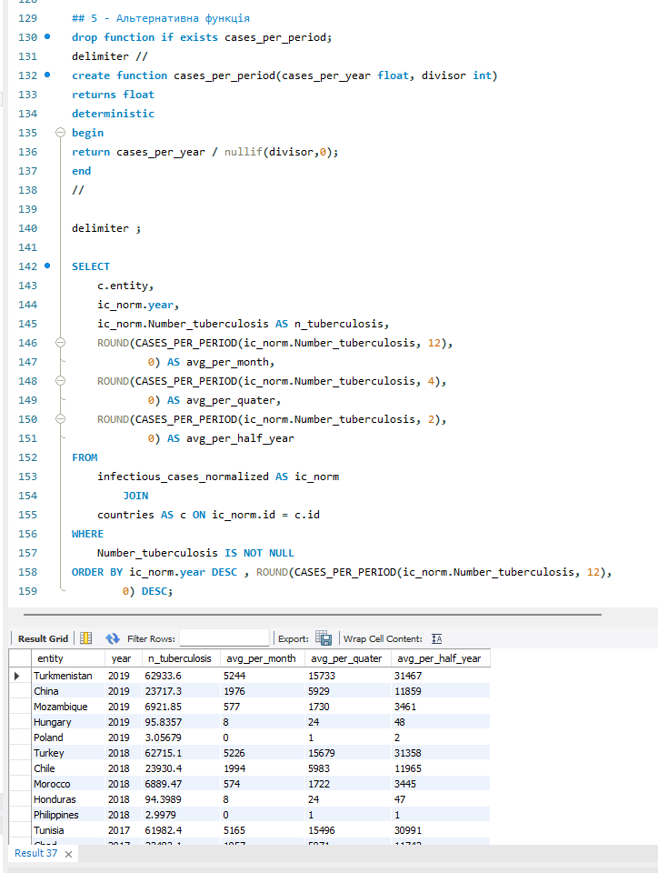
